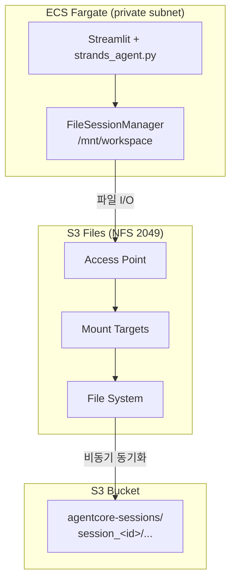
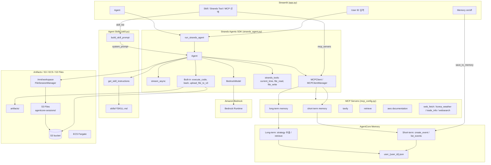

# Strands ECS Agent with AgentCore Memory

[Amazon Bedrock AgentCore Memory](https://docs.aws.amazon.com/bedrock-agentcore/latest/devguide/memory-getting-started.html)를 활용하여 Strands Agent에서 단기/장기 메모리를 구현합니다. 여기에서는 [Strands agent](https://strandsagents.com/0.1.x/)를 이용해 Agentic AI를 구현하는 방법을 설명합니다. Strands Agent는 AI agent 구축 및 실행을 위해 설계된 오픈소스 SDK입니다. 계획(planning), 사고 연결(chaining thoughts), 도구 호출, Reflection과 같은 agent 기능을 쉽게 활용할 수 있습니다.

Agent의 기본 동작 확인 및 구현을 위해 **ECS Fargate**에 Docker 컨테이너 형태로 탑재되어 ALB와 CloudFront를 이용해 Streamlit으로 테스트할 수 있습니다. `installer.py`가 AgentCore Memory IAM Role·Memory 인스턴스·Knowledge Base·ECS 인프라를 자동 배포합니다. User ID별로 대화·메모리를 분리하며, MCP(`short term memory`, `long term memory`)로 에이전트가 필요 시 메모리를 조회합니다.


## Memory

Chatbot은 연속적인 사용자의 대화를 이용하여 사용자의 경험을 향상시킬 수 있습니다. 일반 대화형 chatbot에서는 이전 대화를 [sliding window](https://langchain-ai.github.io/langgraph/concepts/memory/) 형태로 context에 포함하므로 사용할 수 있는 대화의 숫자가 제한됩니다. 여기에서는 short/long term memory를 지원하는 MCP와 AgentCore Memory를 이용하여 필요할 때마다 메모리를 조회·저장합니다.

[AgentCore Memory](https://docs.aws.amazon.com/bedrock-agentcore/latest/devguide/memory-getting-started.html)를 이용하면 별도의 DB 없이 short/long term memory를 손쉽게 활용할 수 있습니다. 대화 transaction은 short-term memory에 저장되고, strategy가 추출한 구조화된 기억은 long-term memory에 namespace로 저장됩니다.

### Short Term Memory

대화 transaction은 [agentcore_memory.py](./application/agentcore_memory.py)의 `save_conversation_to_memory()`로 저장합니다.

```python
memory_result = memory_client.create_event(
    memory_id=memory_id,
    actor_id=actor_id,
    session_id=session_id,
    event_timestamp=event_timestamp,
    messages=conversation
)
```

[mcp_server_short_term_memory.py](./application/mcp_server_short_term_memory.py)의 `list_events`로 최근 대화를 조회합니다.

### Long Term Memory

[mcp_server_long_term_memory.py](./application/mcp_server_long_term_memory.py)의 `long_term_memory` 도구로 record/retrieve/list/get/delete를 수행합니다. 사용자별 변수는 `user_{user_id}.json`에 저장됩니다.

## 사전 설치 (Prerequisites)

```bash
pip install bedrock-agentcore
python installer.py --project-name strands-ecs --region us-west-2
```

`installer.py`가 수행하는 Memory 관련 작업:

1. AgentCore Memory용 IAM Role 생성
2. AgentCore Memory 인스턴스 생성 (`memory_id`를 `application/config.json`에 저장)
3. ECS Fargate·Knowledge Base·AgentCore Web Search Gateway·**S3 Files 세션 스토리지** 등 인프라 배포

## Memory 초기화 흐름

앱 실행 시 [app.py](./application/app.py)에서 User ID를 입력하고, Agent 모드에서 **Memory** 체크박스가 켜져 있으면 응답 후 `chat.save_to_memory()`가 호출됩니다.

```
User ID 입력 → chat.set_user_id() → mcp.env 저장
Agent 응답 + Memory Enable → save_to_memory() → agentcore_memory.save_conversation_to_memory()
```

## 주요 변수

| 파일 | 변수 | 설명 |
|------|------|------|
| `config.json` | `agentcore_memory_role`, `memory_id` | 프로젝트 Memory 설정 |
| `user_{user_id}.json` | `memory_id`, `actor_id`, `session_id`, `namespace` | 사용자별 Memory |
| `config.json` | `s3_files_*`, `s3_files_mount_path` | S3 Files 세션 스토리지 |
| `mcp.env` | `user_id` | MCP memory 서버용 사용자 ID |

## MCP를 이용한 메모리 활용

[mcp_config.py](./application/mcp_config.py)에서 `short term memory`, `long term memory`를 선택하면 stdio MCP 서버가 연결됩니다.

| 구분 | 단기 메모리 | 장기 메모리 |
|------|-----------|-----------|
| 데이터 | 원본 대화 이벤트 | strategy가 추출한 구조화된 기억 |
| MCP 도구 | `list_events` | `long_term_memory` (record/retrieve/list/get/delete) |
| 파일 | `mcp_server_short_term_memory.py` | `mcp_server_long_term_memory.py` |

## Session Management & S3 Files

ECS Fargate 컨테이너 안에서 Strands Agent가 **대화 이력·agent state**를 유지하기 위해 **Amazon S3 Files**를 `/mnt/workspace`에 마운트하고, Strands **`FileSessionManager`**가 해당 경로에 세션을 저장합니다. AgentCore Memory(MCP)와 별개로, Strands SDK의 **session storage**가 Agent 대화 컨텍스트를 영속화합니다.

상세 동작은 [strands-runtime/session-management.md](../strands-runtime/session-management.md)와 동일한 Strands SDK 패턴을 따르며, 이 프로젝트는 **AgentCore Runtime 대신 ECS 태스크**에 S3 Files volume을 붙입니다.

### 한 줄 요약

| 매니저 | 역할 | 저장 위치 |
|---|---|---|
| `conversation_manager` | 모델에 보낼 메시지 **개수/크기 제한** (슬라이딩 윈도우) | 프로세스 메모리 (상태는 session에도 동기화) |
| `session_manager` | 전체 대화·agent state **디스크 저장/복원** | `/mnt/workspace/session_<id>/...` (S3 Files → S3 bucket) |

```
[전체 대화 히스토리]  ← session_manager가 S3 Files(/mnt/workspace)에 저장
        ↓
[슬라이딩 윈도우 50 messages] ← conversation_manager가 모델에 전달할 부분만 선택
        ↓
      LLM 호출
```

### Session ID (Streamlit 로그인)

[strands-runtime/application/app.py](../strands-runtime/application/app.py)와 같이 User ID 로그인 후 **Session ID**를 관리합니다.

| 단계 | 동작 |
|---|---|
| **로그인** | User ID 입력 → `chat.set_user_id()` → `runtime_session_id = uuid5("agentcore-session-{user_id}")` (재접속 시 동일) |
| **대화 초기화** | `chat.initiate()` → 새 `runtime_session_id`(uuid4) → Agent 재생성 |
| **Agent** | `FileSessionManager(session_id=chat.runtime_session_id, storage_dir="/mnt/workspace")` |

[app.py](./application/app.py) 사이드바에 **User ID**, **Session ID**가 표시됩니다. [chat.py](./application/chat.py)의 `runtime_session_id_for()`는 strands-runtime [agentcore_client.py](../strands-runtime/application/agentcore_client.py)와 동일한 deterministic UUID 규칙을 사용합니다.

### 코드 구조 ([strands_agent.py](./application/strands_agent.py))

**conversation_manager** — 모듈 레벨 싱글톤, `window_size=50` (**메시지 개수** 기준, turn 수 아님)

```python
conversation_manager = SlidingWindowConversationManager(window_size=50)
```

**session_manager** — `create_agent()`마다 생성

```python
from strands.session.file_session_manager import FileSessionManager

session_manager = FileSessionManager(
    session_id=get_runtime_session_id(),  # chat.runtime_session_id
    storage_dir=get_session_storage_dir(),  # /mnt/workspace
)

agent = Agent(
    model=model,
    system_prompt=BASE_SYSTEM_PROMPT,
    tools=tools,
    plugins=[skills_plugin] if skills_plugin else [],
    conversation_manager=conversation_manager,
    session_manager=session_manager,
)
```

`run_strands_agent()`는 tool/MCP/skill 설정 또는 **session_id 변경** 시 Agent를 재생성하고, `session_manager.initialize()`로 디스크에서 대화를 복원합니다.

#### window_size 참고

| 흐름 | `agent.messages`에 추가되는 메시지 |
|---|---|
| `request → response` (tool 없음) | **2** (`user` + `assistant`) |
| `request → toolUse → toolResult → response` | **4** |

디스크에는 전체 대화가 저장되고, 모델에는 최근 **50개 메시지**만 전달됩니다.

### 디스크 저장 구조

```
/mnt/workspace/
└── session_<session_id>/
    ├── session.json
    └── agents/
        └── agent_<agent_id>/
            ├── agent.json          # state, conversation_manager_state 등
            └── messages/
                ├── message_0.json
                └── ...
```

S3 측 동기화 경로 (버킷 prefix `agentcore-sessions/`):

```text
s3://storage-for-{project_name}-{account_id}-{region}/
  agentcore-sessions/
    session_<session_id>/
      session.json
      agents/agent_default/...
```

### S3 Files on ECS Fargate

[strands-runtime](../strands-runtime)은 AgentCore Runtime에 S3 Files를 마운트합니다. **이 프로젝트**는 동일한 S3 Files 인프라를 프로비저닝하되, **ECS Fargate 태스크 정의**의 `s3filesVolumeConfiguration`으로 컨테이너에 마운트합니다.



| 항목 | strands-runtime (AgentCore) | strands-ecs-project (ECS) |
|---|---|---|
| 마운트 방식 | `filesystemConfigurations.s3FilesAccessPoint` | ECS task `s3filesVolumeConfiguration` |
| 마운트 경로 | `/mnt/workspace` | `/mnt/workspace` (동일) |
| session_id | `BedrockAgentCoreContext.get_session_id()` | `chat.runtime_session_id` (User ID 기반) |
| IAM | Runtime 실행 역할 | **ECS task role** |
| 네트워크 | Runtime VPC + SG(2049) | ECS task SG + mount target SG(2049) |

#### installer 프로비저닝 (`[5.5/10]`)

[installer.py](./installer.py)의 `create_s3_files_session_storage()`가 **멱등**으로 생성합니다.

1. **Sync IAM role** — `role-s3files-sync-for-{project_name}`
2. **S3 bucket versioning** — `Enabled` (S3 Files 필수)
3. **File system** — bucket + prefix `agentcore-sessions/`
4. **Security groups** — ECS SG ↔ mount target SG (TCP **2049**)
5. **Mount targets** — private subnet별
6. **Access point** — POSIX `uid/gid: 0/0`
7. **File system policy** — ECS task role에 NFS mount/write 허용
8. **ECS task definition** — volume + `mountPoints` → `/mnt/workspace`

`application/config.json`에 기록되는 키:

| 키 | 설명 |
|---|---|
| `s3_files_file_system_id` | S3 Files file system ID |
| `s3_files_access_point_arn` | Access point ARN |
| `s3_files_mount_path` | `/mnt/workspace` |
| `ecs_session_vpc_subnets` | ECS 태스크 subnet 목록 |
| `ecs_session_security_groups` | ECS task security group |

ECS 태스크 정의 예 ([installer.py](./installer.py)):

```python
"volumes": [{
    "name": "session-storage",
    "s3filesVolumeConfiguration": {
        "fileSystemArn": file_system_arn,
        "accessPointArn": access_point_arn,
        "rootDirectory": "/",
    },
}],
"mountPoints": [{
    "sourceVolume": "session-storage",
    "containerPath": "/mnt/workspace",
    "readOnly": False,
}],
```

#### ECS task role IAM (S3 Files)

`attach_ecs_task_s3files_policy()`가 task role에 아래 권한을 추가합니다.

- `s3files:ClientMount`, `ClientWrite`, `ClientRootAccess` (file system ARN + access point 조건)
- `s3files:GetAccessPoint` (access point ARN)
- `s3files:ListMountTargets` (file system ARN)

#### 재시작·배포 시 동작

| 시나리오 | 동작 |
|---|---|
| **같은 User ID로 재접속** | deterministic session id → S3 Files에서 대화 복원 |
| **대화 초기화** | 새 session id → 새 `session_<id>/` 디렉터리 |
| **ECS 태스크 재시작** | `/mnt/workspace`는 S3 Files volume → 세션 유지 |
| **새 Docker 이미지 배포** | 동일 volume 마운트 → 세션 유지 |

> S3 Files는 NFS 기반이므로 S3 API로 즉시 읽을 때 **동기화 지연(~60초)** 이 있을 수 있습니다. `FileSessionManager`만 사용하는 Agent 세션에는 일반적으로 문제 없습니다.

#### 주의사항

- `session_id`는 User ID·대화 초기화 단위로 고유해야 합니다.
- `/mnt/workspace`는 ECS task에 S3 Files volume이 마운트되어 있어야 합니다. 로컬 `streamlit run` 시에는 마운트가 없으므로 세션 영속화는 ECS 배포 환경을 기준으로 합니다.
- mount target AZ·ECS task subnet·SG(2049)가 맞지 않으면 태스크 기동 또는 파일 I/O가 실패할 수 있습니다.
- 세션 파일은 버킷 루트가 아니라 **`agentcore-sessions/`** prefix 아래에 동기화됩니다.

관련 문서: [strands-runtime/session-management.md](../strands-runtime/session-management.md), [strands-runtime/s3files.md](../strands-runtime/s3files.md)


Strands agent는 아래와 같은 [Agent Loop](https://strandsagents.com/0.1.x/user-guide/concepts/agents/agent-loop/)을 가지고 있으므로, 적절한 tool을 선택하여 실행하고, reasoning을 통해 반복적으로 필요한 동작을 수행합니다. 


Tool들을 아래와 같이 병렬로 처리할 수 있습니다.

```python
agent = Agent(
    max_parallel_tools=4  
)
```

## Strands Agent 활용 방법

### Operation Architecture



| 모드 | 모듈 | 설명 |
|------|------|------|
| 일상적인 대화 | `chat.general_conversation` | 대화 이력 + Bedrock Runtime `invoke_model_with_response_stream` 스트리밍 |
| RAG | `chat.run_rag_with_knowledge_base` | Bedrock Knowledge Base 검색(`retrieve`) 후 Bedrock Runtime으로 답변 생성 |
| **Agent** | `strands_agent.run_strands_agent` | Strands SDK + strands_tools + MCP + Skills |
| 이미지 분석 | `chat.summarize_image` | ChatBedrock 멀티모달 (이미지 + 텍스트) 분석 |


### Streamlit에서 agent의 실행

[app.py](./application/app.py)와 같이 사용자가 "RAG", "Agent"을 선택할 수 있습니다. "Agent"은 Strands agent를 이용하여 MCP로 필요시 tool들을 이용하여 RAG등을 활용할 수 있습니다. Streamlit의 UI를 위하여 user의 입력과 결과인 response을 [Session State](https://docs.streamlit.io/develop/api-reference/caching-and-state/st.session_state)로 관리합니다. 

```python
if prompt := st.chat_input("메시지를 입력하세요."):
    with st.chat_message("user"):  
        st.markdown(prompt)
    st.session_state.messages.append({"role": "user", "content": prompt})

    with st.status("thinking...", expanded=True, state="running") as status:
        notification_queue = NotificationQueue(container=status)
        skill_list = selected_skills if selected_skills else []

        response, image_urls = asyncio.run(strands_agent.run_strands_agent(
            query=prompt, 
            strands_tools=selected_strands_tools, 
            mcp_servers=selected_mcp_servers, 
            skill_list=skill_list,
            notification_queue=notification_queue))
```

### Agent의 실행

아래와 같이 system prompt, model, tool 정보를 가지고 agent를 생성합니다.

```python
def create_agent(system_prompt, tools):
    if system_prompt==None:
        system_prompt = (
            "당신의 이름은 서연이고, 질문에 대해 친절하게 답변하는 사려깊은 인공지능 도우미입니다."
            "상황에 맞는 구체적인 세부 정보를 충분히 제공합니다." 
            "모르는 질문을 받으면 솔직히 모른다고 말합니다."
        )
    model = get_model()    
    agent = Agent(
        model=model,
        system_prompt=system_prompt,
        tools=tools,
        conversation_manager=conversation_manager
    )
    return agent
```

[chat.py](./application/chat.py)와 같이 Agent를 실행하고 stream으로 결과를 받아서 보여줍니다. 이때, 아래와 같이 event에서 "data"만을 추출한 후에 full_response로 저장한 후에 markdown으로 표시합니다. 

```python
async def run_strands_agent(query, strands_tools, mcp_servers, containers):
    await strands_agent.initiate_agent(
        system_prompt=None, 
        strands_tools=strands_tools, 
        mcp_servers=mcp_servers
    )

    final_result = current = ""
    with strands_agent.mcp_manager.get_active_clients(mcp_servers) as _:
        agent_stream = strands_agent.agent.stream_async(query)
        
        async for event in agent_stream:
            text = ""            
            if "data" in event:
                text = event["data"]
                logger.info(f"[data] {text}")
                current += text

            elif "result" in event:
                final = event["result"]                
                message = final.message
                if message:
                    content = message.get("content", [])
                    result = content[0].get("text", "")
                    final_result = result
    return final_result
```

### 대화 이력의 활용

Strands Agent는 **두 계층**으로 대화를 관리합니다. ([Session Management & S3 Files](#session-management--s3-files) 참조)

1. **`FileSessionManager`** — 전체 대화를 `/mnt/workspace`(S3 Files)에 영속 저장·복원
2. **`SlidingWindowConversationManager`** — 모델에 전달할 최근 메시지만 in-memory trim

[application/strands_agent.py](./application/strands_agent.py):

```python
from strands.agent.conversation_manager import SlidingWindowConversationManager
from strands.session.file_session_manager import FileSessionManager

conversation_manager = SlidingWindowConversationManager(window_size=50)

session_manager = FileSessionManager(
    session_id=get_runtime_session_id(),
    storage_dir=get_session_storage_dir(),
)

agent = Agent(
    model=model,
    system_prompt=BASE_SYSTEM_PROMPT,
    tools=tools,
    conversation_manager=conversation_manager,
    session_manager=session_manager,
)
```

`window_size=50`은 **메시지 50개** 기준입니다 (tool 1회 포함 요청 ≈ 4 messages).

### MCP 활용

아래와 같이 MCPClient로 stdio_mcp_client을 지정한 후에 list_tools_sync을 이용해 tool 정보를 추출합니다. MCP tool은 strands tool과 함께 아래처럼 사용할 수 있습니다.

```python
from strands.tools.mcp import MCPClient
from strands_tools import calculator, current_time, use_aws

stdio_mcp_client = MCPClient(lambda: stdio_client(
    StdioServerParameters(command="uvx", args=["awslabs.aws-documentation-mcp-server@latest"])
))

with stdio_mcp_client as client:
    aws_documentation_tools = client.list_tools_sync()
    logger.info(f"aws_documentation_tools: {aws_documentation_tools}")

    tools=[    
        calculator, 
        current_time,
        use_aws
    ]

    tools.extend(aws_documentation_tools)

    agent = Agent(
        model=model,
        system_prompt=system,
        tools=tools,
        conversation_manager=conversation_manager
    )
```

또한, wikipedia 검색을 위한 MCP server의 예는 아래와 같습니다. 상세한 코드는 [mcp_server_wikipedia.py](./application/mcp_server_wikipedia.py)을 참조합니다.

```python
from mcp.server.fastmcp import FastMCP
import wikipedia
import logging
import sys

logging.basicConfig(
    level=logging.INFO,  # Default to INFO level
    format='%(filename)s:%(lineno)d | %(message)s',
    handlers=[
        logging.StreamHandler(sys.stderr)
    ]
)
logger = logging.getLogger("rag")

mcp = FastMCP(
    "Wikipedia",
    dependencies=["wikipedia"],
)

@mcp.tool()
def search(query: str):
    logger.info(f"Searching Wikipedia for: {query}")
    
    return wikipedia.search(query)

@mcp.tool()
def summary(query: str):
    return wikipedia.summary(query)

@mcp.tool()
def page(query: str):
    return wikipedia.page(query)

@mcp.tool()
def random():
    return wikipedia.random()

@mcp.tool()
def set_lang(lang: str):
    wikipedia.set_lang(lang)
    return f"Language set to {lang}"

if __name__ == "__main__":
    mcp.run()
```

### 동적으로 MCP Server를 binding하기

MCP Server를 동적으로 관리하기 위하여 MCPClientManager를 정의합니다. add_client는 MCP 서버의 name, command, args, env로 MCP Client를 정의합니다. 

```python
class MCPClientManager:
    def __init__(self):
        self.clients: Dict[str, MCPClient] = {}
        
    def add_client(self, name: str, command: str, args: List[str], env: dict[str, str] = {}) -> None:
        """Add a new MCP client"""
        self.clients[name] = MCPClient(lambda: stdio_client(
            StdioServerParameters(
                command=command, args=args, env=env
            )
        ))
    
    def remove_client(self, name: str) -> None:
        """Remove an MCP client"""
        if name in self.clients:
            del self.clients[name]
    
    @contextmanager
    def get_active_clients(self, active_clients: List[str]):
        """Manage active clients context"""
        active_contexts = []
        for client_name in active_clients:
            if client_name in self.clients:
                active_contexts.append(self.clients[client_name])

        if active_contexts:
            with contextlib.ExitStack() as stack:
                for client in active_contexts:
                    stack.enter_context(client)
                yield
        else:
            yield

# Initialize MCP client manager
mcp_manager = MCPClientManager()
```

Streamlit으로 구현한 [app.py](./application/app.py)에서 tool들을 선택하면 mcp_tools를 얻을 수 있습니다. 이후 아래와 같이 agent 생성시에 active client으로 부터 tool list를 가져와서 tools로 활용합니다.

```python
tools = []
for mcp_tool in mcp_servers:
    with mcp_manager.get_active_clients([mcp_tool]) as _:
        client = mcp_manager.get_client(mcp_tool)
        mcp_servers_list = client.list_tools_sync()
        tools.extend(mcp_servers_list)

agent = create_agent(system_prompt, tools)
tool_list = get_tool_list(tools)
```

생성된 agent는 아래와 같이 mcp_manager를 이용해 실행합니다.

```python
with mcp_manager.get_active_clients(mcp_tools) as _:
    agent_stream = agent.stream_async(question)
    
    tool_name = ""
    async for event in agent_stream:
        if "message" in event:
            message = event["message"]
            for content in message["content"]:                
                if "text" in content:
                    final_response = content["text"]
```


### Streamlit에 맞게 출력문 조정하기

Agent를 아래와 같이 실행하여 agent_stream을 얻습니다.

```python
with mcp_manager.get_active_clients(mcp_servers) as _:
    agent_stream = agent.stream_async(question)
```

사용자 경험을 위해서는 stream형태로 출력을 얻을 수 있어야 합니다. 이는 아래와 같이 agent_stream에서 event를 꺼낸후 "data"에서 추출하여 아래와 같이 current_response에 stream 결과를 모아서 보여줍니다.

```python
async for event in agent_stream:
    if "data" in event:
        text_data = event["data"]
        current_response += text_data

        containers["notification"][index].markdown(current_response)
```

Strands agent는 multi step reasoning을 통해 여러번 결과가 나옵니다. 최종 결과를 얻기 위해 아래와 같이 message의 content에서 text를 추출하여 마지막만을 추출합니다. 또한 tool마다 reference가 다르므로 아래와 같이 tool content의 text에서 reference를 추출합니다.  

```python
if "message" in event:
    message = event["message"]
    for msg_content in message["content"]:                
        result = msg_content["text"]
        current_response = ""

        tool_content = msg_content["toolResult"]["content"]
        for content in tool_content:
            content, urls, refs = get_tool_info(tool_name, content["text"])
            if refs:
                for r in refs:
                    references.append(r)
```

generate_image_with_colors라는 tool의 최종 이미지 경로는 아래와 같이 event_loop_metrics에서 추출합하여 image_urls로 활용합니다.

```python
if "event_loop_metrics" in event and \
    hasattr(event["event_loop_metrics"], "tool_metrics") and \
    "generate_image_with_colors" in event["event_loop_metrics"].tool_metrics:
    tool_info = event["event_loop_metrics"].tool_metrics["generate_image_with_colors"].tool
    if "input" in tool_info and "filename" in tool_info["input"]:
        fname = tool_info["input"]["filename"]
        if fname:
            url = f"{path}/{s3_image_prefix}/{parse.quote(fname)}.png"
            if url not in image_urls:
                image_urls.append(url)
```


## 배포하기

### 사전 요구사항

`installer.py`는 AWS 인프라 생성과 함께 **로컬 Docker**로 컨테이너 이미지를 빌드하여 **ECR**에 push한 뒤 **ECS Fargate** 서비스를 배포합니다.

| 항목 | 설명 |
|------|------|
| Docker CLI | `Dockerfile` 기반 이미지 빌드 (`linux/amd64`) |
| AWS CLI | ECR 로그인 및 자격 증명 |
| boto3 | `pip install boto3` |

배포 시 생성되는 주요 리소스: ECR (`ecr-for-{project_name}`), ECS Cluster/Service (S3 Files volume `/mnt/workspace`), ALB, CloudFront, VPC, Bedrock Knowledge Base (S3 Vectors), **S3 Files** (`agentcore-sessions/` prefix)

상세한 배포 흐름은 [installer.md](./installer.md)를 참조하세요.

### CloudShell 또는 로컬에서 배포

AWS console의 CloudShell을 접속하거나, Docker가 설치된 로컬 환경에서 아래와 같이 준비합니다.

```text
sudo yum install python3 python3-pip git docker -y   # CloudShell / Amazon Linux
pip install boto3
sudo systemctl start docker   # 로컬 Linux에서 Docker 데몬 실행
```

아래와 같이 git source를 가져옵니다.

```text
git clone https://github.com/kyopark2014/strands-ecs-project
```

`installer.py` 상단의 `project_name`, `region`, `git_name`을 확인한 뒤 설치를 시작합니다.

```text
cd strands-ecs-project && python3 installer.py
```

- 이미 ECR에 이미지가 있고 인프라만 갱신할 때: `python3 installer.py --skip-docker-build`

설치가 완료되면 아래와 같은 CloudFront URL로 접속하여 동작을 확인합니다.


컨테이너 설정(`application/config.json` 내용)은 ECS 태스크 환경변수 `APP_CONFIG_JSON`으로 주입되며, `docker-entrypoint.sh`가 컨테이너 시작 시 파일을 생성합니다.

인프라가 더 이상 필요 없을 때에는 `uninstaller.py`를 이용해 제거합니다. (ECS 서비스, ECR 리포지토리, ALB, VPC 등)

```text
python uninstaller.py
```


### 배포된 Application 업데이트 하기

애플리케이션 코드를 변경한 뒤 다시 배포하려면 **Docker 이미지를 재빌드**하고 ECS 서비스를 갱신합니다. 가장 간단한 방법은 `installer.py`를 다시 실행하는 것입니다.

```text
cd strands-ecs-project && python3 installer.py
```

`installer.py`는 ECR에 새 이미지를 push하고, ECS 서비스를 새 태스크 정의로 업데이트합니다(`forceNewDeployment`).

이미지 재빌드 없이 ECS만 재시작하려면 AWS CLI를 사용합니다. (`project_name`을 `installer.py` 설정값에 맞게 변경)

```text
aws ecs update-service \
  --cluster cluster-for-dwfb \
  --service service-for-dwfb \
  --force-new-deployment \
  --region us-west-2
```

또는 [ECS Console](https://us-west-2.console.aws.amazon.com/ecs/v2/clusters)에서 `cluster-for-{project_name}` → `service-for-{project_name}` → **Update service** → **Force new deployment**를 선택합니다.

> 이전 EC2 배포 방식의 `update.sh` / Session Manager 접속은 ECS 배포에서는 사용하지 않습니다.

### Local에서 실행하기

AWS 환경을 잘 활용하기 위해서는 [AWS CLI를 설치](https://docs.aws.amazon.com/ko_kr/cli/v1/userguide/cli-chap-install.html)하여야 합니다. CloudShell 또는 ECS 배포 환경에서는 AWS CLI가 기본 제공되는 경우가 많습니다. 로컬에 설치할 때는 아래 명령어를 참조합니다.

```text
curl "https://awscli.amazonaws.com/awscli-exe-linux-x86_64.zip" -o "awscliv2.zip" 
unzip awscliv2.zip
sudo ./aws/install
```

AWS credential을 아래와 같이 AWS CLI를 이용해 등록합니다.

```text
aws configure
```

설치하다가 발생하는 각종 문제는 [Kiro-cli](https://aws.amazon.com/ko/blogs/korea/kiro-general-availability/)를 이용해 빠르게 수정합니다. 아래와 같이 설치할 수 있지만, Windows에서는 [Kiro 설치](https://kiro.dev/downloads/)에서 다운로드 설치합니다. 실행시는 셀에서 "kiro-cli"라고 입력합니다. 

```python
curl -fsSL https://cli.kiro.dev/install | bash
```

venv로 환경을 구성하면 편리하게 패키지를 관리합니다. 아래와 같이 환경을 설정합니다.

```text
python -m venv .venv
source .venv/bin/activate
```

이후 다운로드 받은 github 폴더로 이동한 후에 아래와 같이 필요한 패키지를 추가로 설치 합니다.

```text
pip install -r requirements.txt
```

이후 아래와 같은 명령어로 streamlit을 실행합니다. 

```text
streamlit run application/app.py
```


### 실행 결과


## Reference

[Strands Python Example](https://github.com/strands-agents/docs/tree/main/docs/examples/python)

[Strands Agents SDK](https://strandsagents.com/0.1.x/)

[Strands Agents Samples](https://github.com/strands-agents/samples/tree/main)

[Example Built-in Tools](https://strandsagents.com/0.1.x/user-guide/concepts/tools/example-tools-package/)

[Introducing Strands Agents, an Open Source AI Agents SDK](https://aws.amazon.com/ko/blogs/opensource/introducing-strands-agents-an-open-source-ai-agents-sdk/)

[use_aws.py](https://github.com/strands-agents/tools/blob/main/src/strands_tools/use_aws.py)

[Strands Agents와 오픈 소스 AI 에이전트 SDK 살펴보기](https://aws.amazon.com/ko/blogs/tech/introducing-strands-agents-an-open-source-ai-agents-sdk/)

[Drug Discovery Agent based on Amazon Bedrock](https://github.com/hsr87/drug-discovery-agent)

[Strands Agent - Swarm](https://strandsagents.com/latest/user-guide/concepts/multi-agent/swarm/)

[Strands Agent Streamlit Demo](https://github.com/NB3025/strands-streamlit-chat-demo)


[생성형 AI로 AWS 보안 점검 자동화하기: Q CLI에서 Strands Agents까지](https://catalog.us-east-1.prod.workshops.aws/workshops/89fc3def-0260-4fa7-91ce-623ad9a4d04a/ko-KR)

[AI Agent를 활용한 EKS 애플리케이션 및 인프라 트러블슈팅](https://catalog.us-east-1.prod.workshops.aws/workshops/bbd8a1df-c737-4f88-9d19-17bcecb7e712/ko-KR)

[Strands Agents 및 AgentCore와 함께하는 바이오·제약 연구 어시스턴트 구현하기](https://catalog.us-east-1.prod.workshops.aws/workshops/fe97ac91-ff75-4753-a269-af39e7c3d765/ko-KR)

[Strands Agents & Amazon Bedrock AgentCore 워크샵](https://github.com/hsr87/strands-agents-for-life-science)

[Agentic AI로 구현하는 리뷰 관리 자동화](https://catalog.us-east-1.prod.workshops.aws/workshops/59ea75b5-532c-4b57-982e-e58152ae5c46/ko-KR)

[Strands Agent Workshop (한국어)](https://github.com/chloe-kwak/strands-agent-workshop)

[Agentic AI Workshop: AI Fund Manager](https://catalog.us-east-1.prod.workshops.aws/workshops/a8702b51-fcf3-43b3-8d37-511ef1b38688/ko-KR)

[Agentic AI 펀드 매니저](https://github.com/ksgsslee/investment_advisor_strands)

[Workshop - Strands SDK와 AgentCore를 활용한 에이전틱 AI](https://catalog.workshops.aws/strands/ko-KR)
